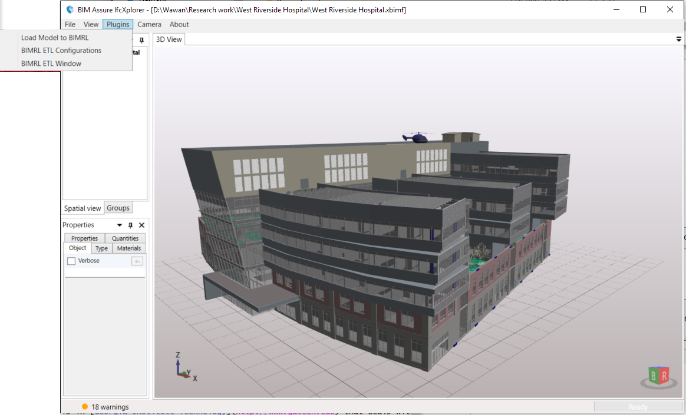

# BIMRL-ETL
## What is it?
BIMRL stands for **B**uilding **I**nformation **M**odeling (BIM) **R**ule **L**anguage.
ETL stands for **E**xtract, **T**ransform and **L**oad

BIMRL-ETL is a module developed as part of the author's Ph.D. thesis in [Georgia Institute Technology](http://www.gatech.edu) that deals with BIM-based automated rule checking system. This module transforms IFC building models into an RDBMS simplified schema. The aim is to provide an efficient query-ability into BIM data that is traditionally difficult and slow.

The main features of BIMRL simplifies schema are:
* It is based on a proven RDBMS technology, which allows it to free users from the burden of reinventing the wheel on something that has worked so well.
* The RDBMS schema uses only 20 tables to capture IFC data relatively losless (within the scope of IFC CV2.0 MVD). It follows the Data Warehouse concept with simple star-schema that center around one single table for all the building objects
* It revolves around main concepts of: building objects, their properties, their relationships mainly with each other but also with other information such as Type, Classification and Material, geometry and spatial
* It also integrates a concept of a circulation graph connecting spaces though the walkable openings or doors horizontally and through stairs, ramps, or elevators vertically

It uses Xbim; the eXtensible [Building Information Modelling (BIM) Toolkit](https://xbimteam.github.io/) to parse the IFC file before transforming it into the RDBMS simplified schema. This module is provided as a plugin to XbimWindowsUI.

It currently works only with Oracle RDBMS because it uses the Spatial Data Object (Oracle Spatial) to store the geometry. Beyond that BIMRL handles everything else such as generation of the spatial indexes, bounding boxes and the planar boundary representations.

## Getting Started
You will need to have a few things:

1. Download and setup an Oracle database. It has to be at *minimum* the **Standard Edition**. **Oracle 12c** is recommended. Oracle allows free download and use for development purpose but not for commercial use without paying the license. You can download it from [Oracle Technology Network](http://www.oracle.com/technetwork/database/enterprise-edition/downloads/index.html)

  1. Once you have successfully setup and created a database instance, you need to run a [setup script](script/setup.sql) inside the [script](script/) folder. It is best to run it from inside the folder as it calls other scripts located in the same folder
  2. At least one user has to be created. It is recommended to use the following settings since there are some default settings used in BIMRL with these values. You may change these values by modifying the script and changing configurations in BIMRL UIs.
    * Userid: bimrl
    * password: bimrl
    * DB service name: pdborcl

2. You also need Visual Studio 2015 to compile BIMRL as well as Xbim. Visual Studio Community Edition from Microsoft is sufficient. It can be downloaded for free from [Microsoft Visual Studio Website](https://www.visualstudio.com/downloads/)

3. Download Xbim modules needed for BIMRL. They can be downloaded directly from [Xbim Github](https://xbimteam.github.io/), or from a forked project for [Invicara BIM Assure](https://github.com/invicara/). The later version contains small modification to improve XbimWindowsUI. They are also available through nuget packages that can be used directly within the Visual Studio project. There 3 modules needed:
  * [Xbim Essentials](https://github.com/Invicara/XbimEssentials)
  * [Xbim Geometry](https://github.com/Invicara/XbimGeometry)
  * [Xbim WindowsUI or Xplorer](https://github.com/Invicara/XbimWindowsUI)

4. Once you are able to compile BIMRL, the project executables need to be copied to XbimXplorer\Plugins folder keeping the project names the same as a plugin folder:
  * BIMRL_ETL.XplorerPlugin
  * BIMRL_ETLConfig.XplorerPlugin
  * BIMRL_Main.XplorerPlugin

## License
BIMRL-ETL source code is made available under LGPLv3 and later. It allows the the library to be linked to any application even the commercial application without making the application to carry the same license. Only moficiation to the BIMRL-ETL codes will have to be licensed as well as LGPLv3 and later.

## Contents
The three plugins if setup correctly will appear in the menu:

1. BIMRL_ETL.XplorerPlugin
  This module is the entry point to perform ETL from the IFC model loaded by Xbim into the Oracle DB.

2. BIMRL_ETLConfig.XplorerPlugin
  This module allows a few configuration settings for the session.

3. BIMRL_Main.XplorerPlugin
  This module is the main module for all models that are uploaded into BIMRL database

In addition, BIMRL has also developed a compare models functionality that comes both in a [command line utility](BIMRLDiffModelsCmd/) and [UI](BIMRLDiffModelsUI/).

## Acknowledgement
The author wishes that by making this project open source, more people will benefit from it. Also the research community is encouraged to develop this further for the benefits of the community.

The Compare Models functionality is supported by Autodesk as part of the development support for its IFC functionality in AutoCAD Architecture.

